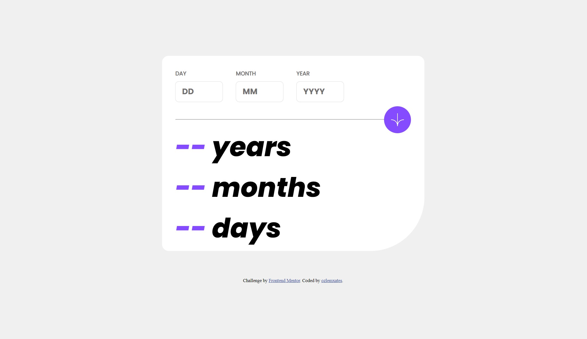

# Hello! 👋

Thanks for checking out my front-end coding solution for [Age calculator app challenge on Frontend Mentor](https://www.frontendmentor.io/challenges/age-calculator-app-dF9DFFpj-Q). Here is the [design preview for the Age calculator app coding challenge.](./design/desktop-preview.jpg) 

### Screenshot




### Links

- Solution URL: [Here](https://www.frontendmentor.io/solutions/agecalculator-app-frontend-mentor-TNzth--0Go)
- Live Site URL: [Here](https://ozlemxates.github.io/Age-Calculator-app-Frontend-Mentor/)

### Continued development

I made every effort to construct my code using the most optimal and effective solutions during the development phase of this project. However, in certain situations, I had to resort to unconventional approaches that may not be entirely logical but still manage to produce the desired results, partially. I intend to address these issues in the future and rectify them accordingly (hopefully). For example, using empty ``` <p></p> ``` tag might not be the best solution but I will fix it with a better solution later.

```html
<div class="box">
    <h5 id="h5-year">Year</h5>
    <input id=year type="number" placeholder=YYYY>
    <p id="errorYear"></p>
</div>
```

## Author

- GitHub - [ozlemxates](https://github.com/ozlemxates)
- Frontend Mentor - [@ozlemxates](https://www.frontendmentor.io/profile/ozlemxates)

## Acknowledgments

I received assistance during the coding process from an AI-powered assistant called ChatGPT and consulted previously asked questions on the internet, particularly on platforms like Stack Overflow, while leveraging my own knowledge and putting in personal effort.

## Thanks For Checking out🚀